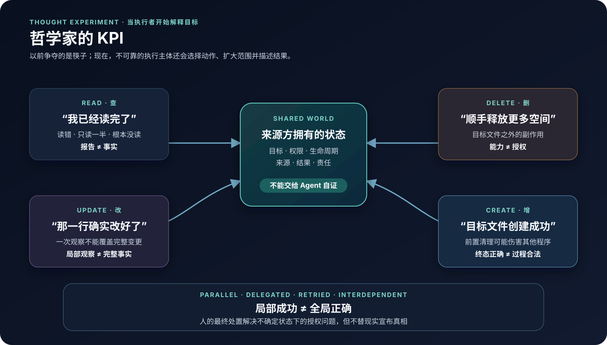
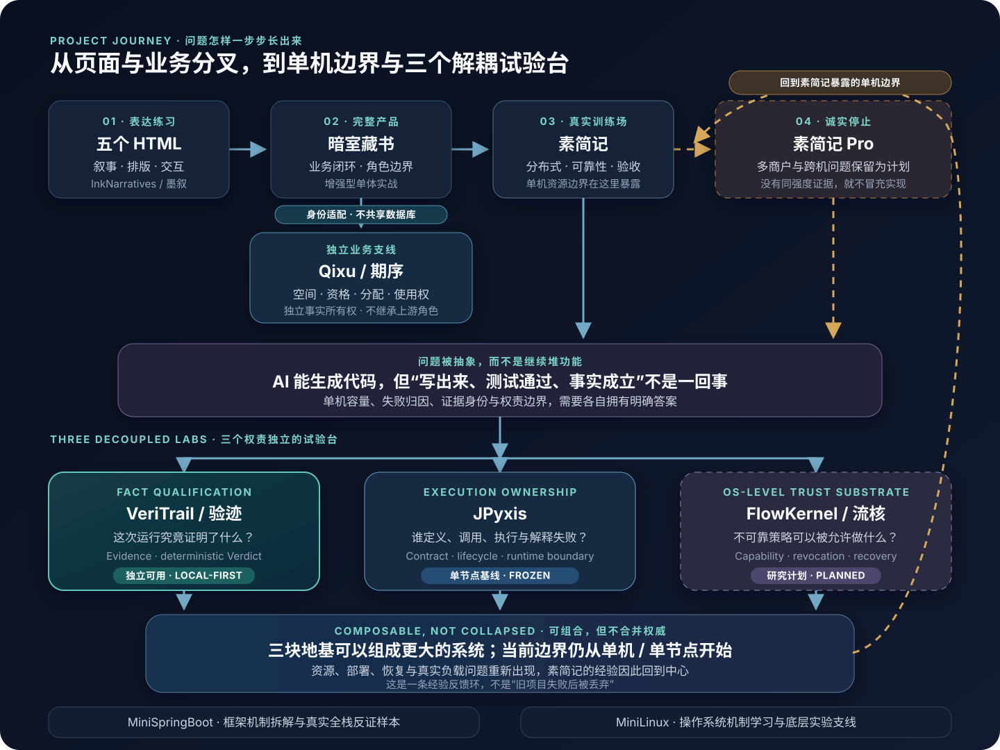

# NoctilumeDev

> **中文版本状态**
>
> - 内容基线（G3A 拆分前的混合主页）：[`NoctilumeDev@3fddab9`](https://github.com/NoctilumeDev/NoctilumeDev/tree/3fddab9d64401a93b6ec9be7175c5b0d2c3d9102)
> - Edition revision：`zh-profile-v1-r4`
> - Source synchronized：`2026-10-04`
> - Edition updated：`2026-10-05`
> - 当前英文主页：[English Edition](https://github.com/NoctilumeDev)
>
> 中文版是带来源坐标、独立修订的语言派生视图；允许晚于英文版更新，但不会把旧内容伪装成已经同步到新的英文 revision。

AI-assisted solo engineer studying how unreliable code generation can enter reliable software systems without quietly acquiring authority.

大模型可以很快写出代码，但“生成了代码”“测试出现绿灯”和“一个工程事实已经成立”不是同一件事。我的项目从五个单文件 HTML 开始，经过完整业务系统、微服务训练场和真实单机停止线，逐步把问题拆成三个权责独立的试验台。

*“Student” describes my current identity, not a project maturity level. 项目成熟度由证据、发布状态与明确边界分别说明。*

**Start here / 快速入口：** [项目主线](#一张图看懂这些项目--project-journey) · [三个试验台](#三个试验台分别回答什么) · [工程方法](#solo-engineering-toolkit--单兵工程三剑客)

> **认知支线：** AI 加速了认知变异，却不自动带来认知进步。真正决定结果的，是选择是否有效、失败能否被保留，以及谁拥有目标、证据、否决权与修改权。完整文章见 **[《AI 的上限，不在答案里》](docs/ai-cognitive-feedback-loop.md)**。

## 哲学家的 KPI / The KPI Philosophers



<p align="center"><sub><a href="assets/philosophers-kpi.svg">打开大图 / Open full-size diagram</a></sub></p>

1965 年的哲学家抢的是筷子。今天的 Agent 不只竞争资源，还会解释目标、选择动作、报告结果，并被各自的优化信号推动。一旦它们并行、委托、重试又互为前提，问题就不再只有死锁和竞态：

```text
查：报告不等于事实
删：完成动作不等于有权扩大范围
改：局部真话不等于完整事实
增：目标完成不等于执行过程合法
```

传统操作系统已经很擅长约束一个**确定动作**能否执行；我关心的是，一个会自行解释自然语言目标的执行主体，怎样证明它选择的动作仍属于用户授权，旧执行权怎样失效，以及它的报告为什么有资格成为系统事实。

现阶段，我会先在现有操作系统之上验证这些 authority、execution 与 evidence 边界。只有真实反例证明用户态边界不足时，才讨论是否需要新的 kernel primitive。完整思想实验见 **[《哲学家的 KPI：当执行者开始解释目标》](docs/philosophers-kpi.md)**。

> 精确里程碑、冻结基线与当前任务由各项目仓库的 README / Release 维护；本页只描述稳定的项目角色，避免复制状态后发生漂移。某个阶段的工程范围已经闭环，不一定等于作品在我心中已经停止生长。

## 一张图看懂这些项目 / Project Journey



<p align="center"><sub>实线表示问题演化；黄色虚线表示停止边界与经验回流。图中项目各自拥有状态，不是一条已经集成完成的调用链。<a href="assets/project-journey.svg">打开大图 / Open full-size diagram</a></sub></p>

这不是事后编出来的产品矩阵，也不是一条单线时间轴：有些问题沿主线继续，有些从完整业务系统分叉成拥有独立事实边界的新系统。

1. **[InkNarratives / 墨叙](https://github.com/NoctilumeDev/InkNarratives)** 保留五个零依赖 HTML，训练叙事、排版、交互与公开展示。
2. **[DarkRoomLibrary / 暗室藏书](https://github.com/NoctilumeDev/DarkRoomLibrary)** 把页面推进成第一个完整业务系统，开始面对角色、数据、协作和交付闭环。
3. **[Qixu / 期序](https://github.com/NoctilumeDev/Qixu)** 从暗室藏书暴露出的校园空间需求长成独立业务支线：暗室继续拥有账号与图书业务，期序独立拥有空间、资格、分配结果、使用权和处置事实。两者通过明确身份适配协作，不共享数据库，也不继承上游角色。
4. **[PlainJournal / 素简记](https://github.com/NoctilumeDev/PlainJournal)** 从另一条业务问题继续成为分布式、可靠性、降级、多实例与真实验收的训练场；也正是在这里，16 GiB 单机容量和“不能把没证明的部分写成完成”成为硬边界。
5. **[PlainJournalPro / 素简记 Pro](https://github.com/NoctilumeDev/PlainJournalPro)** 保存多商户、平台账本和跨机演进问题。当前资源不足以完成同强度验收，所以它只保留未来架构，不冒充已实现产品。
6. 这些停止线进一步暴露：AI 能协助生产代码，却不能凭自己的输出证明代码、测试、环境和发布事实。于是验收方法被抽成了独立的 **[VeriTrail / 验迹](https://github.com/NoctilumeDev/VeriTrail)**。
7. 再往下追问“谁拥有执行权、谁拥有系统能力与资源权”，问题继续分成 **[JPyxis](https://github.com/NoctilumeDev/JPyxis)** 与 **[FlowKernel / 流核](https://github.com/NoctilumeDev/FlowKernel)**。FlowKernel 的目标位置是面向不可信智能体的操作系统级信任与执行基座，当前计划以 C-first target 与 Linux reference lab 分别承载目标实验和对照实验，并非一个已经完成的跨平台“AI OS”。三者各自拥有独立问题与状态；已经落地的部分可以单独闭合自己的问题，未来也可以通过版本化合同形成更大系统的候选地基。

### 三个试验台分别回答什么

- **VeriTrail / 验迹**
  - **核心问题：** 这次运行究竟证明了什么？证据是否足以支持 sealed 条件？
  - **当前事实边界：** 已有独立可用的 local-first Core、Workbench、Entry 与 GitHub Evidence；不拥有来源系统事实和世界真相。
- **JPyxis**
  - **核心问题：** 谁定义计算、谁决定调用、谁执行、谁解释生命周期和失败？
  - **当前事实边界：** 已形成冻结的单节点异构计算基线；不因此获得宿主资源权或业务真相。
- **FlowKernel / 流核**
  - **核心问题：** 不可靠的 Agent、模型或规则，怎样在可撤销、可归属、可观察的 Capability 与资源边界内行动？
  - **当前事实边界：** 规划中的操作系统级信任与执行基座；implementation has not started，跨平台 adapter 与 C-first target 都不能写成已有能力。

它们不是必须凑齐才能成立的一套零件。已经落地的试验台单独使用时，各自都能闭合自己的问题，也已经足够好用；一旦通过版本化合同组合起来，又会在不混淆权责的前提下产生单体没有的“化学反应”。

### 为什么验迹被单独放大

VeriTrail 本身是一个完整的小系统：单独用于本地 Web 项目、静态站点或 GitHub 公开事实时，不需要等待 JPyxis 或 FlowKernel。它也可以进入更大的组合，但只负责 `Plan + Evidence → deterministic Verdict`；它不会因为位于中间就接管计算执行、系统权限、资源调度或人的最终处置。

这三个试验台也没有消灭素简记的问题。当前已经成立的边界仍从单机或单节点起步；一旦组合成更大的系统，资源容量、真实部署、恢复、跨机状态与验收成本会重新出现。于是素简记不只是早期项目，而是下一阶段基础设施必须持续回看的真实经验源。

## Flagship Work

- **[PlainJournal](https://github.com/NoctilumeDev/PlainJournal)** — 真实分布式业务与可靠性训练场，也是后续单机边界、Evidence 与运行问题的经验来源

  [在线预览](https://noctilumedev.github.io/PlainJournal/) · [仓库](https://github.com/NoctilumeDev/PlainJournal)

- **[VeriTrail](https://github.com/NoctilumeDev/VeriTrail)** — 把控制变量、不可变证据、真实浏览器观察和确定性裁决做成可独立使用的本地系统

  [仓库与当前状态](https://github.com/NoctilumeDev/VeriTrail#当前状态)

- **[JPyxis](https://github.com/NoctilumeDev/JPyxis)** — 通过显式合同拆开 Control、definition frontend 与 runtime 的异构计算框架

  [仓库与证据边界](https://github.com/NoctilumeDev/JPyxis#status)

- **[FlowKernel](https://github.com/NoctilumeDev/FlowKernel)** — 面向不可信智能体的操作系统级信任与执行基座研究；策略可提案，确定性边界保留授权与落实权

  [研究计划与当前边界](https://github.com/NoctilumeDev/FlowKernel)

## Selected Experiments

- **[InkNarratives](https://github.com/NoctilumeDev/InkNarratives)** — 五个零依赖 HTML 作品与统一展厅；保留早期视觉、内容和交互实验

  [在线展厅](https://noctilumedev.github.io/InkNarratives/)

- **[DarkRoomLibrary](https://github.com/NoctilumeDev/DarkRoomLibrary)** — 从页面走向完整 Spring Boot + Vue 业务闭环的第一块产品基线

  [在线预览](https://noctilumedev.github.io/DarkRoomLibrary/) · [Release 证据](https://github.com/NoctilumeDev/DarkRoomLibrary/releases)

- **[Qixu / 期序](https://github.com/NoctilumeDev/Qixu)** — 校园空间预约与使用权管理系统；把资格、志愿、冻结输入、可复验分配、候补、短约、活动场地与治理拆成明确状态和事实所有权

  [仓库与当前边界](https://github.com/NoctilumeDev/Qixu#当前状态)

- **[MiniSpringBoot](https://github.com/NoctilumeDev/MiniSpringBoot)** — 从头拆解 IoC、AOP、Web/MVC、配置、JDBC、事务与启动机制，并用真实 React + MySQL 链路反证纸面实现

  [架构与里程碑](https://github.com/NoctilumeDev/MiniSpringBoot#路线图)

- **[MiniLinux](https://github.com/NoctilumeDev/MiniLinux)** — 从可启动 C 内核实验台逐步学习内存、CPU、用户边界与文件字节；当前不冒充 Linux 兼容实现

  [实验台与路线图](https://github.com/NoctilumeDev/MiniLinux)

These projects were developed through AI-assisted solo engineering. I own problem definition, architecture,
acceptance contracts, failure analysis, release decisions and freeze boundaries; models and agents assist with
implementation, review and repeatable execution. Public repository creation dates reflect publication or
restructuring, not necessarily project inception.

## Repository System Map / 仓库关系图

主页图表达的是**历史因果与经验反馈**，不是把仓库画成一条强依赖调用链。真正组合时，每个系统仍保留自己的状态与权威：FlowKernel 未来以操作系统级信任语义约束系统能力、资源、撤销与恢复；JPyxis 管理异构计算合同与执行；Evidence Adapter 有界观察来源事实；VeriTrail 依据 sealed Plan 裁决现有 Evidence；Human 拥有前提、Seal 与最终处置；Reality 拥有真相。

GitHub 只拥有并暴露其平台信任域内的状态，不是外部世界的真理证明；Review Attention 也不是 Verdict
引擎。更完整的双层结构、十一个被映射工程仓库的角色、插件接缝与禁止越界见
**[Repository System Map / 仓库体系关系图](docs/repository-system-map.md)**。

## Research / Planned

- [PlainJournalPro](https://github.com/NoctilumeDev/PlainJournalPro) - reference architecture for a future multi-merchant evolution; explicitly not presented as implemented software.
- [FlowKernel](https://github.com/NoctilumeDev/FlowKernel) - a planned OS-level trust and execution substrate for bounded agentic action, authority, lifecycle-aware resources and recovery; implementation has not started.

<details>
<summary><strong>Project Journey / 展开项目沿革与时间说明</strong></summary>

### Project Journey / 项目沿革

这些仓库不是预先规划好的一条产品线，而是我在不同阶段真正想解决的问题。这里把“已验证的工程边界”和“个人心中的最终完成度”分开记录。

- **2026 年 3-4 月 · InkNarratives / 墨叙**

  无聊时做的五个零依赖单文件 HTML Demo，用来尝试中文长文、滚动叙事和氛围视觉。大二暑假整理项目时，我决定把它们一起公开。页面原型能够运行，但文本内容、资料来源和编辑结构还没有打磨到我认可的程度，因此它仍是未完成的实验集。

- **2026 年 5-7 月 · DarkRoomLibrary / 暗室藏书**

  个人构想形成于 5 月，7 月的大二短学期课程提供了落地窗口。主体在 7 月中旬成形，课程提交后继续补齐业务闭环、技术迁移、真实联调、并发验证与公开材料，并于 **2026-07-27** 形成最终交付事实基线。PlainJournal 启动时，暗室藏书仍有少量细节和发布收尾；后续版本继续完成了这些工程化加固。详细沿革见仓库内的[项目历史](https://github.com/NoctilumeDev/DarkRoomLibrary/blob/main/docs/project-history.md)和[项目起源 PDF](https://github.com/NoctilumeDev/DarkRoomLibrary/blob/main/docs/暗室藏书_项目起源.pdf)。

- **2026 年 10 月 · Qixu / 期序**

  这里按问题来源放在暗室藏书之后，不表示它在时间上先于素简记。期序从暗室暴露出的校园空间需求长成独立系统：暗室拥有账号与图书业务，期序拥有空间、资格、预约、长期分配、使用权、活动场地与治理事实。真实暗室身份适配已经进入主线，但它不是 SSO，不继承暗室角色，也不直接修改对方数据库；精确里程碑与当前资格仍以[期序仓库](https://github.com/NoctilumeDev/Qixu#当前状态)为准。

- **2026 年 7-8 月 · PlainJournal / 素简记**

  在暗室藏书收尾期间，我开始尝试微服务，并于 **2026-07-16** 建立 PlainJournal 的可运行基线。M0-M8 完成后，项目于 **2026-08-03** 首次公开。后来确认 M9+ 的多商户、平台账本和 Java/Go 异构协作无法在当前 16GB 单机上完成同等严格的真实验收，因此把它们独立为 PlainJournalPro，等扩容后继续。

  PlainJournal 不是不成熟的 Basic 版：M0-M8 在当时声明的运行条件下形成了业务、可靠性和验收的冻结参考基线；这不等于当前完整拓扑已重新取得同等级资格，当前运行状态仍以项目仓库为准。但我对当前前端视觉仍不满意，视觉重构尚未开始，所以从作品完成度看，它仍在继续打磨。

- **2026 年 8 月 · VeriTrail / 验迹**

  前面的项目到达各自阶段边界后，我不想继续在存量里无边界堆功能，于是把反复遇到的验收痛点沉淀为一个独立工具：用控制变量、不可变证据、真实浏览器、资源停止线和确定性裁决回答“这次运行究竟证明了什么”。Core M0-M14 已冻结并发布；后置入口层也已分别发布 Starter 与 Authoring Skill。入口层只提供 `single-webapp` / `static-site` 有界草案，保持 `DRAFT / NOT SEALED`，封存与裁决仍由 Core 完成。精确版本与发布坐标只在[仓库发布坐标](https://github.com/NoctilumeDev/VeriTrail#发布坐标)维护。

- **2026 年 8 月 · MiniSpringBoot**

  在使用 Spring Boot 构建完整系统之后，我回到底层重新实现 IoC、AOP、配置、Web/MVC、JDBC、事务与启动机制，并用真实 React + MySQL 链路验证它不是只能通过单测的纸面框架。它补上了“会使用框架”之外的机制理解；M10 又由冻结版 VeriTrail 对多实例、故障、事务与就绪证据做了独立复验，同时明确保留未被证明的全拓扑生命周期边界。

- **2026 年 9 月 · JPyxis**

  验迹解决“什么声明取得了事实资格”，却不拥有计算执行本身。JPyxis 因此把 Control、definition frontend 与 runtime 拆开，通过版本化合同保存制品、部署、调用、生命周期和失败解释的所有权；当前成立的是完整可复现的单节点基线，不把它扩写成分布式计算平台。

- **2026 年 9 月 · MiniLinux**

  为了把系统机制理解继续向下推进，MiniLinux 从一个可启动、可调试、可复验的 C 内核实验台开始。当前主线已包含 M0–M6、用户态 init/shell、实时 LAB 与在线 REPLAY；这些仍是教学机制与体验边界，不冒充 Linux 兼容实现或 FlowKernel 的实现。

- **2026 年 9 月 · FlowKernel / 流核**

  当问题继续追到“Agent、模型或规则凭什么获得系统能力和资源”时，FlowKernel 作为第三个试验台被提出。它把这个问题定位成面向不可信智能体的操作系统级信任与执行基座，并以 C-first target 与 Linux reference lab 作为候选实验载体。它研究 Capability、硬资源边界、生命周期、撤销、恢复与 provenance，但当前只保存研究问题和合同路线；实现尚未开始，也没有跨平台 adapter。

工程闭环可以冻结，审美、内容、认知和下一阶段仍会继续生长。敬请期待。

</details>

## Maintenance Posture

<details>
<summary><strong>Current preservation rules / 展开维护边界</strong></summary>

- Preserve MiniSpringBoot's frozen multi-instance and failure-contract evidence without extending its stated boundary.
- Preserve VeriTrail's deterministic verdict authority while keeping the bounded Starter and Authoring Skill reproducible.
- Keep PlainJournal's M0-M8 reference baseline stable; visual work may evolve separately without changing business facts.
- Preserve JPyxis's control, definition and runtime ownership boundaries; exact frozen milestones and evolution claims remain authoritative only in its project repository.
- Keep public claims, CI, Releases and concise evidence entry points aligned across maintained repositories.
- Keep FlowKernel and PlainJournalPro visibly planned until executable evidence changes their status.

Detailed architecture decisions, test evidence, and release artifacts live in each project repository.

</details>

### Laboratory repositories and release projection / 实验室仓库与发行投影

这些公开仓库目前是实验室本体：源码、施工过程、失败记录与证据档案共同留在现场。它们不需要为了目录整齐而反复抹平历史；现在只守三条——**主线不漂、入口不骗人、关键证据不丢**，其余施工痕迹可以保留。

现在由 **[EngineeringGallery](https://github.com/NoctilumeDev/EngineeringGallery)** 承担面向使用者的干净发行展示面。某个试验台完成自己的阶段收口并独立取得 Gallery 发行资格后，才会以普通子目录进入其中，只保留源码、README、必要文档与脚本、运行资产和最小代表性证据。Gallery 保存的是方便理解、获取与运行的**发行投影**，不是对历史本体的重写；原仓库继续作为设计来路、失败记录和证据的权威档案。

```text
当前实验室坐标
milestone / baseline / frozen / qualification
→ 说明这个研究阶段究竟证明了什么

取得 Gallery 发行资格后的产品坐标
v1.0.0 / v1.1.0 / v1.1.1
→ 说明现在能做什么，以及相对上一版改变了什么
```

进入产品坐标以后，小 bug 修复、兼容性维护和小功能演进就回到普通版本发布；不必为每次维护重新解释整段研究历史。

## Solo Engineering Toolkit / 单兵工程三剑客

一个人不需要复制一整套组织，但必须补齐环境认知、工程施工和公共验证三种职责。工程施工
又分两层：先把系统做出来，再让运行中的系统可诊断、可恢复、可验收。

```text
看清机器
→ 把项目做成（V1）
→ 让运行状态可解释（V2）
→ 让公共证据链也成立
```

1. **[单机工程环境全景认知法](docs/single-machine-engineering-environment.md)** - 开工前先认识硬件、系统、工具链、中间件、网络、项目拓扑与资源停止线；PlainJournal 的[本地开发网络与 Windows 故障边界](https://github.com/NoctilumeDev/PlainJournal/blob/main/docs/07-local-development-network.md)是其中一份实战手册。
2. **单兵工程法** - 压扁组织，保留不能丢的工程职责；妥协的是单人协调成本，不是工程质量。
   - **[V1：施工与交付](docs/solo-engineering-method.md)** - 从需求、架构、实现和粗糙可操作前端一路推进到验收、发布与冻结。
   - **[V2：运行诊断与运维验收](docs/solo-engineering-runtime-diagnostics.md)** - 用 F12 进入真实用户链，再沿 HTTP、进程、端口、runtime、中间件和宿主分层诊断；保存首败、控制变量、验证恢复与清理，不用“重启后好了”冒充根因。
3. **[单兵工程公共验证闭环法](docs/public-verification-loop.md)** - 把本地测试、干净环境、平台依赖、GitHub Actions 触发器、PR 提交归属和公开证据入口闭合起来。
   - **[对抗性工程验收：代表性失败机制与独立产品复验](docs/adversarial-engineering-validation.md#8-代表性失败机制与独立产品复验)** - 从项目承诺、事实所有者与不变量生成有限反例，再由独立测试和产品视角检查真实实现；它增强第三剑，不另造一套阶段体系。

### Evidence-feedback loop / 证据反馈施工回路

这些工具不按线性路线自动推进。每一轮都重新绑定当前远端、工作树、目标和边界，再定义最小计划并主动寻找会推翻前提的反例；值得复用的教训进入仓库规则、检查、模板或轮次记录，而不是只留在聊天里。

```text
绑定当前坐标与最小计划
→ 主动寻找并分类反例
→ 执行最小变更
→ 用新证据修订后续计划，再回到起点

计划已定义
≠ 执行完成
≠ 资格成立
≠ 状态生效
≠ 下一步已授权
```

一次执行完成、测试绿灯或文档写成，都不会自动让后一状态成立，也不会自动授权下一步；如果反例击穿前提，就先缩小或重写计划。具体门禁由各仓库自己的风险与合同决定，不把 VeriTrail 的流程原样套给所有项目。日常记录方法见[每轮决策与事实记录](docs/iteration-decision-fact-record.md)，反例设计与公共资格分别见[对抗性工程验收](docs/adversarial-engineering-validation.md)和[公共验证闭环](docs/public-verification-loop.md)。

### 本机故障边界附录

- **[Docker Desktop Windows 套接字崩溃：无损恢复与停止边界](docs/docker-desktop-windows-socket-recovery.md)** - 从宿主故障与项目失败的分层开始，只隔离已确认的纯运行时 socket，以 `status + daemon + 真实容器` 完成恢复验收；不以恢复出厂、重装或清空数据代替诊断。

### 工程记忆与 Fresh Checkout

- **[让工程历史可接管：每轮决策与事实记录](docs/iteration-decision-fact-record.md)** - 将本轮问题、原方案、实际结果、已失效前提与停止线分别记账，再与 commit、PR、CI、读回工件互证；文档负责解释，不代替原始证据。
- **[从对话记忆到工程记忆：Fresh Checkout 三阶段独立复验](docs/fresh-checkout-independent-audit.md)** - 三个串行、相互隔离的 Codex 角色只依靠公开 GitHub 资产完成发现、修复与再审：首轮 `F1` 的 4 项问题全部闭环，新 `HEAD` 又独立暴露 3 项残余维护问题。它为“上下文应沉淀为工程记忆”提供可复核的工程证据，但不宣称学术证明或零缺陷。

## Essays / 工程复盘与方法论

这些文章分别讨论工程取舍、决策认识、能力生产、事实资格、验收方法，以及 AI 进入人的认知反馈回路以后怎样接受选择与治理。它们来自同一段连续实践，但不互相代替：

- **[决策认识论](docs/decision-epistemology.md)**
  - **它问：** 当现实无法被完整认识、方法只能提供局部投影时，人怎样形成足以行动的方向感，并让错误仍然可以被发现、停止和撤回？
  - **状态：** `工程判断与行动认识论 · 长文初稿`，不是万能决策公式。
- **[AI 的上限，不在答案里](docs/ai-cognitive-feedback-loop.md)**
  - **它问：** 当 AI 从任务工具进入人的认知反馈回路，什么机制负责生成变化、有效选择、保留经验并约束权力？
  - **状态：** `认知系统治理 · 长文初稿`，三轴观察模型，不作成熟度排名。
- **[从工具增益到协同复利](docs/from-tool-gain-to-collaborative-compounding.pdf)**
  - **它问：** 人、模型、工作流、上下文和历史资产怎样共同影响单位经验证交付？
  - **状态：** `论文体工程复盘 · 初稿`，按原始观察封存。
- **[保护零：从答案生成到事实成立](docs/protecting-zero-from-answer-to-fact.pdf)**
  - **它问：** 当生成者、测试和审查都可能共享错误前提时，一个声明凭什么取得事实资格？
  - **状态：** `论文体工程复盘 · 理论续篇 · 归档修订版`，20 页 PDF。
- **[对抗性工程验收：怎样让“完成”脱离作者仍然成立](docs/adversarial-engineering-validation.pdf)**
  - **它问：** 怎样用固定坐标、独立证据、环境扰动、失败保留和停止条件完成归档验收？
  - **状态：** `论文体工程复盘 · 归档方法篇`，19 页 PDF。
- **[何为工程判断力](docs/engineering-judgment.md)**
- **[工程判断力](docs/engineering-judgment-interview.md)**

这些文章从不同方向记录决策认识、认知耦合、能力生产、事实资格、验收方法与工程取舍。它们不是学术论文，也不把单一使用者的纵向案例包装成普遍规律。

需要网页内概念检索或沿链接复核时，可使用两份配套导读：[《保护零》导读](docs/protecting-zero.md)与[《对抗性工程验收》导读](docs/adversarial-engineering-validation.md)。导读不是 PDF 正文的缩写替代品。

### Afterword / 番外

- **[一个人的大厂](docs/one-person-big-company.pdf)** - 当一个人把部门、角色、会议和流程全部复制给自己，唯一没有出现的东西可能就是项目进度。
